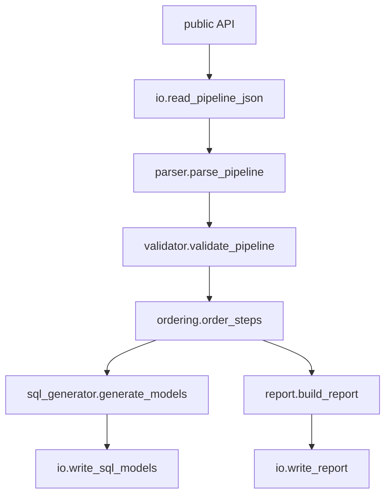

## 1. Project architecture

The layered design stands. Changes from clarifications:

- **Remove CLI layer** — v1 is a library invoked by tests (and later a CLI wrapper).
- **Parsing tolerates extra fields** — unknown keys on step objects are dropped, not rejected.
- **SQL generated only for non-source steps** — sources are inputs to the graph, not emitted models.



### Package layout

```
legacy_pipeline_converter/
  __init__.py          # re-exports public API
  models.py
  errors.py
  parser.py
  validator.py
  ordering.py
  sql_generator.py
  report.py
  io.py
  api.py               # orchestration entry points (replaces cli.py)
tests/
  conftest.py
  fixtures/
    legacy_pipeline.json   # copy of data/legacy_pipeline.json
  test_parser.py
  test_validator.py
  test_ordering.py
  test_sql_generator.py
  test_report.py
  test_api.py
data/
  legacy_pipeline.json
docs/
  clarifications-v1.md
```

### Pipeline flow (confirmed)

1. **Read** JSON from path or string.
2. **Parse** → typed `Pipeline` (extra fields ignored).
3. **Validate** → references, uniqueness, outputs, join types, unsupported types.
4. **Order** → topological sort of step dependencies.
5. **Generate** → one deterministic SQL string per non-source step.
6. **Report** → JSON-serializable `ConversionReport`.
7. **Write** (optional, via I/O helpers) → `.sql` files and report JSON.

Steps not on any path to an output step are **not validated or reported** (C11).

---

## 2. Domain models (finalised)

### Confirmed requirements

```python
# Step types — fields derived from data/legacy_pipeline.json + clarifications

SourceStep:       id, path
FilterStep:       id, input, condition
CalculatedColumnStep: id, input, column, expression
JoinStep:         id, left, right, left_key, right_key, join_type
OutputStep:       id, input, table

Pipeline:         name, steps  # declaration order preserved from JSON
```

- Step `id`s are **globally unique** (validation error if duplicated).
- `join_type` ∈ `{inner, left, right, full}`.
- `Step` is a **tagged union** (separate frozen dataclasses), not an inheritance tree.

### Supporting models

```python
OrderedPipeline:
    pipeline: Pipeline
    execution_order: tuple[str, ...]   # step ids in dependency order

GeneratedModel:
    step_id: str
    filename: str                      # always f"{step_id}.sql"
    sql: str

ConversionReport:                      # C7 — exact top-level fields
    pipeline_name: str
    status: Literal["success", "failed"]
    models_generated: list[str]        # see recommendation below
    errors: list[str]
    warnings: list[str]
```

### Error model (C10)

```python
ConversionError(Exception):
    step_id: str | None      # None only for pipeline-level errors (e.g. zero outputs)
    field: str | None
    message: str

    def __str__(self) -> str: ...
    # e.g. "Invalid dependency: step 'valid_orders' references unknown step 'orders_raw'."
```

Subtypes for clarity (implementation recommendation): `ParseError`, `ValidationError`, `UnsupportedStepTypeError`, `MissingReferenceError`, `InvalidJoinTypeError`, `CyclicDependencyError`, `NoOutputStepError`.

### Implementation recommendation (not specified)

- Use `tuple` for immutable collections inside domain objects; `list` only where mutation is needed before freezing.
- `models_generated`: list of filenames (`"valid_orders.sql"`, …) in execution order among generated models. C7 does not define element shape; filenames are sufficient for acceptance testing.
- `status`: `"failed"` if validation or ordering raises before generation; `"success"` otherwise. Parsing failures may also set `"failed"` if using the high-level `convert_pipeline` API that catches errors into the report.
- For **source references in SQL** (C3: “existing relations”): use the **basename of `path` without extension** as the relation identifier (e.g. `orders.csv` → `orders`). This is not specified in clarifications; alternatives would be full path or step id.

---

## 3. Module responsibilities and public APIs (finalised)

### Module responsibilities

| Module | Responsibility |
|--------|----------------|
| **`models.py`** | All dataclasses and type aliases; no logic |
| **`errors.py`** | `ConversionError` hierarchy and formatting per C10 |
| **`parser.py`** | JSON/dict → `Pipeline`; map `type` to step class; ignore extra fields; raise on missing required fields or unknown `type` |
| **`validator.py`** | Post-parse validation (see §4); raise `ConversionError` subclasses |
| **`ordering.py`** | Build dependency graph; topological sort; cycle detection |
| **`sql_generator.py`** | `OrderedPipeline` → `tuple[GeneratedModel, ...]`; deterministic templates |
| **`report.py`** | Assemble `ConversionReport` per C7 |
| **`io.py`** | `read_pipeline_json(path) -> dict`; `write_sql_models(dir, models)`; `write_report(path, report)` |
| **`api.py`** | Orchestration composing the above |

### Public API (confirmed: Python only, C9)

Exposed from `legacy_pipeline_converter/__init__.py`:

| Function | Signature (recommendation) | Returns |
|----------|---------------------------|---------|
| `parse_pipeline` | `(data: dict) -> Pipeline` | Parsed pipeline |
| `validate_pipeline` | `(pipeline: Pipeline) -> Pipeline` | Same pipeline if valid; raises on failure |
| `order_steps` | `(pipeline: Pipeline) -> OrderedPipeline` | Pipeline + execution order |
| `generate_models` | `(ordered: OrderedPipeline) -> tuple[GeneratedModel, ...]` | SQL models |
| `build_report` | `(pipeline, ordered, models, *, status, errors, warnings) -> ConversionReport` | Report object |
| `convert_pipeline` | `(data: dict) -> tuple[OrderedPipeline, tuple[GeneratedModel, ...], ConversionReport]` | Full static conversion; collects errors into report on failure |

Lower-level functions are public so tests can target each acceptance criterion in isolation. `convert_pipeline` is the integration entry point.

### Implementation recommendation

- `read_pipeline_json` / `write_*` stay in `io.py`, not re-exported as primary API unless useful for integration tests.
- `parse_pipeline` does **not** validate references — keeps parsing vs validation separate per `AGENTS.md`.
- `convert_pipeline` runs parse → validate → order → generate → report in one call; on validation/ordering failure, return `status: "failed"` with populated `errors` and empty `models_generated`.

---

## 4. Validation and dependency ordering (finalised)

### Validation rules (confirmed)

| Rule | When | Error (C10) |
|------|------|-------------|
| Unknown `type` | Parse | `step_id`, `type`, message |
| Missing required field | Parse | `step_id`, field name, message |
| Duplicate step `id` | Validate | `step_id`, `id`, message |
| Unknown `input` / `left` / `right` reference | Validate | dependent `step_id`, `input`/`left`/`right`, message |
| Unsupported `join_type` | Validate | `step_id`, `join_type`, message |
| Zero output steps | Validate | pipeline-level (`step_id=None`), `steps`, message |
| Cyclic dependencies | Order | `step_id` of a node in the cycle, `input`/`left`/`right`, message |

**Not validated in v1 (confirmed):**

- Orphan steps (C11) — no warning, no error.
- Expression / condition syntax (C5).
- Extra JSON fields (C2) — silently ignored at parse time.

### Dependency graph (confirmed)

| Step type | Dependencies (must appear before this step) |
|-----------|-----------------------------------------------|
| `source` | none |
| `filter`, `calculated_column`, `output` | `input` |
| `join` | `left`, `right` |

### Ordering algorithm (confirmed + recommendation)

**Confirmed:** Return all steps in **dependency order** (acceptance criterion).

**Recommendation for determinism:** Kahn’s topological sort with tie-breaking by **original JSON declaration index**. That yields a unique order when the example pipeline is converted:

```
orders_source → valid_orders → orders_with_revenue → customers_source → enriched_orders → final_output
```

(`customers_source` before `enriched_orders` because it appears earlier in JSON and has no unresolved deps when `enriched_orders` becomes ready.)

Cycle detection: if sorted count < step count → `CyclicDependencyError`.

---

## 5. SQL generation and conversion report (finalised)

### SQL generation (confirmed)

| Step type | Generate SQL? | Template behaviour |
|-----------|---------------|-------------------|
| `source` | **No** | — |
| `filter` | Yes | `SELECT * FROM <upstream> WHERE <condition>` |
| `calculated_column` | Yes | `SELECT *, <expression> AS <column> FROM <upstream>` |
| `join` | Yes | `<JOIN_TYPE> JOIN` on `left_key` / `right_key` |
| `output` | Yes | `SELECT * FROM <upstream>` (table name stored for report/metadata only in v1; filename remains `{step_id}.sql`) |

**Upstream reference rules (confirmed):**

- Transformed step → `{{ ref('step_id') }}`
- Source step → existing relation (implementation recommendation: basename of `path`, e.g. `orders`)

**Confirmed:** No `config()` blocks. ANSI SQL passthrough for conditions/expressions. No column quoting.

**Determinism (confirmed):** Same input → identical SQL text and file list, always.

### Example for `data/legacy_pipeline.json` (illustrative)

| Step | File | Upstream reference |
|------|------|-------------------|
| `orders_source` | *(none)* | — |
| `valid_orders` | `valid_orders.sql` | `orders` |
| `orders_with_revenue` | `orders_with_revenue.sql` | `{{ ref('valid_orders') }}` |
| `customers_source` | *(none)* | — |
| `enriched_orders` | `enriched_orders.sql` | `{{ ref('orders_with_revenue') }}` + `customers` |
| `final_output` | `final_output.sql` | `{{ ref('enriched_orders') }}` |

### Conversion report (confirmed — C7)

```json
{
  "pipeline_name": "order_revenue_pipeline",
  "status": "success",
  "models_generated": [
    "valid_orders.sql",
    "orders_with_revenue.sql",
    "enriched_orders.sql",
    "final_output.sql"
  ],
  "errors": [],
  "warnings": []
}
```

On failure, `status` is `"failed"`, `models_generated` is `[]`, and `errors` contains C10-formatted strings.

**Implementation recommendation:** `warnings` is always `[]` in v1 (orphans ignored per C11; SPEC’s orphan-warning text is superseded). Serialize via `dataclasses.asdict` or an explicit `to_dict()` on `ConversionReport`.

---

## 6. Ordered test list (mapped to acceptance criteria)

Write tests in this order (TDD). Each maps to a **confirmed** acceptance criterion from `SPEC.md`.

| # | Test | Criterion |
|---|------|-----------|
| **Parsing** | | |
| 1 | `test_parse_example_pipeline_succeeds` — `data/legacy_pipeline.json` → `Pipeline` with 6 correctly typed steps | Valid example parsed successfully |
| 2 | `test_parse_unsupported_step_type_raises_clear_error` — unknown `type`; assert step id, field, message | Unsupported types → clear error |
| 3 | `test_parse_missing_required_field_raises_clear_error` — e.g. filter without `condition` | *(supports clear errors; invalid input)* |
| 4 | `test_parse_ignores_extra_fields` — step with unknown key still parses | C2 confirmed behaviour |
| **Validation** | | |
| 5 | `test_validate_missing_dependency_raises_clear_error` — bad `input` ref | Invalid/missing dependencies → clear error |
| 6 | `test_validate_join_missing_left_reference_raises_clear_error` | Invalid/missing dependencies → clear error |
| 7 | `test_validate_invalid_join_type_raises_clear_error` — e.g. `cross` | Unsupported join types (C6 + SPEC line 55) |
| 8 | `test_validate_duplicate_step_id_raises_clear_error` | Step IDs must be unique |
| 9 | `test_validate_zero_output_steps_raises_clear_error` | At least one output required |
| 10 | `test_validate_multiple_output_steps_allowed` | Multiple outputs allowed |
| 11 | `test_validate_orphan_steps_do_not_fail` — unreachable step; conversion succeeds | C11 confirmed |
| **Ordering** | | |
| 12 | `test_order_steps_returns_dependency_order` — example pipeline full order | Transformations in dependency order |
| 13 | `test_order_steps_detects_cycle_raises_clear_error` | Invalid dependencies → clear error |
| **SQL generation** | | |
| 14 | `test_sql_filter_step` | Unit tests per supported type |
| 15 | `test_sql_calculated_column_step` | Unit tests per supported type |
| 16 | `test_sql_join_step` — including all four join types | Unit tests per supported type |
| 17 | `test_sql_output_step` | Unit tests per supported type |
| 18 | `test_sql_source_step_not_generated` — no file for `source` | One SQL per non-source step |
| 19 | `test_sql_uses_ref_for_transformed_upstream` | `{{ ref('step_id') }}` (C3) |
| 20 | `test_sql_source_referenced_as_existing_relation` | Sources as existing relations (C3) |
| 21 | `test_sql_generation_is_deterministic` — byte-identical on repeat | Generated SQL deterministic |
| 22 | `test_sql_filename_is_step_id_dot_sql` | Predictable naming convention |
| **Reporting** | | |
| 23 | `test_conversion_report_schema` — C7 fields, correct types | JSON conversion report created |
| 24 | `test_conversion_report_success_lists_generated_models` | JSON conversion report created |
| 25 | `test_conversion_report_failure_populates_errors` | Clear errors surfaced in report |
| **Integration** | | |
| 26 | `test_convert_pipeline_end_to_end_example` — full API on example JSON | Combines all criteria |
| 27 | `test_complete_suite_passes` — meta / CI gate | Complete test suite passes before merge |

**Note:** There is no dedicated `test_sql_source_step` content test (sources produce no SQL). Coverage is via tests 18 and 20. Filter, calculated_column, join, and output each have explicit generation tests (14–17), satisfying “unit tests cover every supported transformation type.”

---

## Summary: confirmed vs recommended

| Area | Confirmed (clarifications / SPEC) | Implementation recommendation |
|------|-----------------------------------|-------------------------------|
| Input path | `data/legacy_pipeline.json` | Copy to `tests/fixtures/` for isolation |
| Extra fields | Ignored (clarifications) | Strip at parse time per step dict |
| API surface | Python only, no CLI | `api.py` with functions listed above |
| SQL files | Non-source steps only; `{step_id}.sql` | — |
| dbt refs | `{{ ref() }}` for transforms | Source → basename of `path` without extension |
| Report | C7 schema | `models_generated` = list of filenames; `warnings` always `[]` in v1 |
| Orphans | Ignored | Do not traverse from outputs to mark reachable steps |
| Ordering | Topological dependency order | Tie-break by JSON declaration index |
| Errors | step id + field + message | Subtype exceptions + formatted string for report |
| Execution | Not in v1 | — |

### Remaining minor gap (flagged, not blocking)

**Source relation naming** (basename vs step id vs path) is the one substantive detail clarifications do not fix. Basename-of-path is recommended because it aligns with `orders.csv` / `customers.csv` in the example and with “existing relations.” If you prefer step id (e.g. `orders_source`), say so before implementation and tests 20/26 can be pinned to that choice.

Two clarifications are now authoritative: **C12** (JSON declaration order for tie-breaking) and **C13** (source relation = basename of `path` without extension). Below are the targeted proposal updates, then the final v1 test plan.

---

## Targeted proposal updates

Only two areas change from the previous proposal; everything else stands.

### Dependency ordering (C12 — now confirmed, not a recommendation)

When multiple valid topological orderings exist, **tie-break by original JSON declaration index**. Implementation: Kahn’s algorithm, enqueue ready steps in ascending declaration order.

For `data/legacy_pipeline.json`, the confirmed execution order is:

```
orders_source → valid_orders → orders_with_revenue → customers_source → enriched_orders → final_output
```

`customers_source` appears before `enriched_orders` because it is declared earlier and both are ready once their dependencies are satisfied.

### Source relation naming (C13 — now confirmed)

| `path` | SQL relation name |
|--------|-------------------|
| `orders.csv` | `orders` |
| `customers.csv` | `customers` |
| `data/products.parquet` | `products` |

Referenced **directly** in SQL — never via `{{ ref() }}`. A small helper in `sql_generator.py` (e.g. `source_relation_name(path: str) -> str`) is sufficient; no separate module required.

### Example SQL references (unchanged logic, now fully pinned)

| Step | File | Upstream in SQL |
|------|------|-----------------|
| `orders_source` | *(none)* | — |
| `valid_orders` | `valid_orders.sql` | `orders` |
| `orders_with_revenue` | `orders_with_revenue.sql` | `{{ ref('valid_orders') }}` |
| `customers_source` | *(none)* | — |
| `enriched_orders` | `enriched_orders.sql` | `{{ ref('orders_with_revenue') }}` + `customers` |
| `final_output` | `final_output.sql` | `{{ ref('enriched_orders') }}` |

---

## Final ordered test plan for v1

Tests are listed in implementation order. Write each test before its minimum production component.

---

### Phase 1: Parsing and domain models

| # | Test file | Test name | Behaviour tested | Verifies | Min. production component |
|---|-----------|-----------|------------------|----------|---------------------------|
| 1 | `tests/test_parser.py` | `test_parse_example_pipeline_succeeds` | `data/legacy_pipeline.json` parses into a `Pipeline` named `order_revenue_pipeline` with 6 steps in declaration order | AC: valid example parsed successfully; C1 | `models.py`, `parser.parse_pipeline` |
| 2 | `tests/test_parser.py` | `test_parse_source_step_fields` | A `source` step maps to `SourceStep` with `id` and `path` | AC: parse source steps; scope item 2 | `models.SourceStep`, `parser.parse_pipeline` |
| 3 | `tests/test_parser.py` | `test_parse_filter_step_fields` | A `filter` step maps to `FilterStep` with `id`, `input`, `condition` | AC: parse filter steps; scope item 2 | `models.FilterStep`, `parser.parse_pipeline` |
| 4 | `tests/test_parser.py` | `test_parse_calculated_column_step_fields` | A `calculated_column` step maps to `CalculatedColumnStep` with `id`, `input`, `column`, `expression` | AC: parse calculated-column steps; scope item 2 | `models.CalculatedColumnStep`, `parser.parse_pipeline` |
| 5 | `tests/test_parser.py` | `test_parse_join_step_fields` | A `join` step maps to `JoinStep` with `id`, `left`, `right`, `left_key`, `right_key`, `join_type` | AC: parse join steps; scope item 2 | `models.JoinStep`, `parser.parse_pipeline` |
| 6 | `tests/test_parser.py` | `test_parse_output_step_fields` | An `output` step maps to `OutputStep` with `id`, `input`, `table` | AC: parse output steps; scope item 2 | `models.OutputStep`, `parser.parse_pipeline` |
| 7 | `tests/test_parser.py` | `test_parse_unsupported_step_type_raises_clear_error` | Unknown `type` (e.g. `aggregate`) raises an error containing step id, field (`type`), and a human-readable message | AC: unsupported types → clear error; C10 | `errors.UnsupportedStepTypeError`, `parser.parse_pipeline` |
| 8 | `tests/test_parser.py` | `test_parse_missing_required_field_raises_clear_error` | A `filter` step without `condition` raises an error with step id, field name, and message | AC: clear errors on invalid input; C10 | `errors.ParseError`, `parser.parse_pipeline` |
| 9 | `tests/test_parser.py` | `test_parse_ignores_extra_fields` | A step dict with an unknown key still parses into the correct typed step; extra key is not stored | C2 | `parser.parse_pipeline` |
| 10 | `tests/test_parser.py` | `test_parse_missing_pipeline_name_raises_clear_error` | Top-level JSON without `name` raises a parse error | Edge case; AGENTS.md invalid-input rule | `errors.ParseError`, `parser.parse_pipeline` |
| 11 | `tests/test_parser.py` | `test_parse_empty_steps_list_succeeds` | Pipeline with `"steps": []` parses to an empty `Pipeline` (validation deferred to phase 2) | Separation of parse vs validate | `parser.parse_pipeline` |

---

### Phase 2: Validation

| # | Test file | Test name | Behaviour tested | Verifies | Min. production component |
|---|-----------|-----------|------------------|----------|---------------------------|
| 12 | `tests/test_validator.py` | `test_validate_duplicate_step_id_raises_clear_error` | Two steps sharing the same `id` raise a validation error with step id, field (`id`), and message | C2; C10 | `errors.ValidationError`, `validator.validate_pipeline` |
| 13 | `tests/test_validator.py` | `test_validate_missing_input_reference_raises_clear_error` | A `filter` referencing a non-existent `input` raises an error naming the dependent step, field (`input`), and the unknown id | AC: invalid/missing dependencies → clear error; C10 | `errors.MissingReferenceError`, `validator.validate_pipeline` |
| 14 | `tests/test_validator.py` | `test_validate_join_missing_left_reference_raises_clear_error` | A `join` with an unknown `left` step raises a clear error | AC: invalid/missing dependencies → clear error; C10 | `errors.MissingReferenceError`, `validator.validate_pipeline` |
| 15 | `tests/test_validator.py` | `test_validate_join_missing_right_reference_raises_clear_error` | A `join` with an unknown `right` step raises a clear error | AC: invalid/missing dependencies → clear error; C10 | `errors.MissingReferenceError`, `validator.validate_pipeline` |
| 16 | `tests/test_validator.py` | `test_validate_invalid_join_type_raises_clear_error` | `join_type: "cross"` raises an error with step id, field (`join_type`), and message | C6; C10 | `errors.InvalidJoinTypeError`, `validator.validate_pipeline` |
| 17 | `tests/test_validator.py` | `test_validate_all_supported_join_types_pass` | `inner`, `left`, `right`, `full` each pass validation | C6 | `validator.validate_pipeline` |
| 18 | `tests/test_validator.py` | `test_validate_zero_output_steps_raises_clear_error` | Pipeline with no `output` step raises a validation error | C2; C10 | `errors.NoOutputStepError`, `validator.validate_pipeline` |
| 19 | `tests/test_validator.py` | `test_validate_multiple_output_steps_allowed` | Pipeline with two `output` steps referencing valid inputs passes validation | C2 | `validator.validate_pipeline` |
| 20 | `tests/test_validator.py` | `test_validate_orphan_steps_do_not_fail` | A step not referenced by any path to an output does not cause validation failure | C11 | `validator.validate_pipeline` |
| 21 | `tests/test_validator.py` | `test_validate_example_pipeline_passes` | Parsed `data/legacy_pipeline.json` passes validation unchanged | AC: valid example; scope item 3 | `validator.validate_pipeline` |

---

### Phase 3: Dependency ordering

| # | Test file | Test name | Behaviour tested | Verifies | Min. production component |
|---|-----------|-----------|------------------|----------|---------------------------|
| 22 | `tests/test_ordering.py` | `test_order_example_pipeline_returns_dependency_order` | Example pipeline returns all 6 step ids in order: `orders_source`, `valid_orders`, `orders_with_revenue`, `customers_source`, `enriched_orders`, `final_output` | AC: transformations in dependency order; C12 | `models.OrderedPipeline`, `ordering.order_steps` |
| 23 | `tests/test_ordering.py` | `test_order_independent_steps_follow_json_declaration_order` | A pipeline where two sources are both dependencies of a later join lists the source declared first before the one declared second | C12 | `ordering.order_steps` |
| 24 | `tests/test_ordering.py` | `test_order_cycle_raises_clear_error` | A cycle (A → B → A) raises an error with step id, relevant field, and message | AC: invalid dependencies → clear error; C10 | `errors.CyclicDependencyError`, `ordering.order_steps` |
| 25 | `tests/test_ordering.py` | `test_order_is_deterministic` | Calling `order_steps` twice on the same pipeline returns identical `execution_order` | AC: generated SQL deterministic (ordering is a prerequisite); C12 | `ordering.order_steps` |

---

### Phase 4: SQL generation

| # | Test file | Test name | Behaviour tested | Verifies | Min. production component |
|---|-----------|-----------|------------------|----------|---------------------------|
| 26 | `tests/test_sql_generator.py` | `test_generate_source_step_produces_no_model` | A `source` step produces no `GeneratedModel` | C3; AC: unit tests per type | `sql_generator.generate_models` |
| 27 | `tests/test_sql_generator.py` | `test_generate_filter_step_sql` | A `filter` step produces SQL selecting from upstream with `WHERE <condition>`; condition passed verbatim | AC: unit tests per supported type; C5 | `sql_generator.generate_models` |
| 28 | `tests/test_sql_generator.py` | `test_generate_calculated_column_step_sql` | A `calculated_column` step produces SQL with `<expression> AS <column>`; expression passed verbatim | AC: unit tests per supported type; C5 | `sql_generator.generate_models` |
| 29 | `tests/test_sql_generator.py` | `test_generate_join_step_sql` | A `join` step produces SQL with correct join type and `ON left_key = right_key` for all four supported types | AC: unit tests per supported type; C6 | `sql_generator.generate_models` |
| 30 | `tests/test_sql_generator.py` | `test_generate_output_step_sql` | An `output` step produces SQL selecting all columns from its `input` upstream | AC: unit tests per supported type | `sql_generator.generate_models` |
| 31 | `tests/test_sql_generator.py` | `test_generate_uses_ref_for_transformed_upstream` | SQL for a step whose input is a non-source step contains `{{ ref('input_step_id') }}` | C3 | `sql_generator.generate_models` |
| 32 | `tests/test_sql_generator.py` | `test_generate_uses_source_relation_name_for_source_upstream` | SQL referencing a `source` step uses the basename-without-extension relation name, not `{{ ref() }}` | C3; C13 | `sql_generator.source_relation_name`, `sql_generator.generate_models` |
| 33 | `tests/test_sql_generator.py` | `test_source_relation_name_strips_nested_path_and_extension` | `data/products.parquet` resolves to relation name `products` | C13 | `sql_generator.source_relation_name` |
| 34 | `tests/test_sql_generator.py` | `test_generate_filename_is_step_id_dot_sql` | Every generated model has `filename` equal to `{step_id}.sql` | AC: predictable naming convention; C4 | `models.GeneratedModel`, `sql_generator.generate_models` |
| 35 | `tests/test_sql_generator.py` | `test_generate_does_not_include_config_blocks` | Generated SQL contains no `{{ config(` or `config(` blocks | C3 | `sql_generator.generate_models` |
| 36 | `tests/test_sql_generator.py` | `test_generate_example_pipeline_models` | Example pipeline produces exactly 4 models (`valid_orders`, `orders_with_revenue`, `enriched_orders`, `final_output`) with expected upstream references (`orders`, `{{ ref('valid_orders') }}`, etc.) | C1; C3; C13; integration of generation rules | `sql_generator.generate_models` |
| 37 | `tests/test_sql_generator.py` | `test_generate_is_deterministic` | Two calls to `generate_models` on the same `OrderedPipeline` return byte-identical SQL and filenames | AC: generated SQL deterministic | `sql_generator.generate_models` |

---

### Phase 5: Conversion report

| # | Test file | Test name | Behaviour tested | Verifies | Min. production component |
|---|-----------|-----------|------------------|----------|---------------------------|
| 38 | `tests/test_report.py` | `test_build_report_success_schema` | A successful build returns an object serializable to JSON with keys `pipeline_name`, `status`, `models_generated`, `errors`, `warnings` | AC: JSON conversion report created; C7 | `models.ConversionReport`, `report.build_report` |
| 39 | `tests/test_report.py` | `test_build_report_success_populates_models_generated` | On success, `status` is `"success"`, `models_generated` lists generated filenames in order, `errors` and `warnings` are empty | C7 | `report.build_report` |
| 40 | `tests/test_report.py` | `test_build_report_failure_populates_errors` | On failure, `status` is `"failed"`, `models_generated` is empty, `errors` contains C10-formatted strings | C7; C10 | `report.build_report` |
| 41 | `tests/test_report.py` | `test_build_report_warnings_empty_in_v1` | A successful conversion of a pipeline with orphan steps yields `warnings: []` | C11; C7 | `report.build_report` |

---

### Phase 6: End-to-end conversion

| # | Test file | Test name | Behaviour tested | Verifies | Min. production component |
|---|-----------|-----------|------------------|----------|---------------------------|
| 42 | `tests/test_api.py` | `test_convert_pipeline_example_succeeds` | `convert_pipeline` on example JSON returns `status: "success"`, 4 models, correct execution order, and no errors | All ACs combined; C1 | `api.convert_pipeline` |
| 43 | `tests/test_api.py` | `test_convert_pipeline_invalid_input_returns_failed_report` | `convert_pipeline` on a pipeline with a missing dependency returns `status: "failed"` and populated `errors` without raising | AC: clear errors; C7 | `api.convert_pipeline` |
| 44 | `tests/test_io.py` | `test_read_pipeline_json_loads_example_file` | `read_pipeline_json` reads `data/legacy_pipeline.json` into a dict suitable for `parse_pipeline` | Scope item 1: reading from JSON; C1 | `io.read_pipeline_json` |
| 45 | `tests/test_io.py` | `test_write_sql_models_and_report_creates_files` | `write_sql_models` and `write_report` write expected `.sql` files and a JSON report to disk | AC: JSON conversion report created; C4 | `io.write_sql_models`, `io.write_report` |
| 46 | `tests/test_api.py` | `test_end_to_end_file_round_trip` | Read example JSON from disk → `convert_pipeline` → write outputs → verify 4 `.sql` files and report JSON on disk | Full scope items 1, 5, 6; all ACs | `io.*`, `api.convert_pipeline` |

---

## Implementation phase summary

| Phase | Tests | Production components introduced |
|-------|-------|----------------------------------|
| 1 — Parsing | 1–11 | `models.py`, `errors.py`, `parser.py` |
| 2 — Validation | 12–21 | `validator.py` |
| 3 — Ordering | 22–25 | `ordering.py` |
| 4 — SQL generation | 26–37 | `sql_generator.py` |
| 5 — Report | 38–41 | `report.py` |
| 6 — End-to-end | 42–46 | `api.py`, `io.py` |

Total: **46 tests** across **6 test files**.

---

## Remaining specification ambiguities

All major planning ambiguities are resolved. A few minor gaps remain; none should block v1 implementation if the recommendations below are adopted:

| Gap | Status | Practical resolution |
|-----|--------|----------------------|
| **`models_generated` element shape** | C7 shows an empty array but not element type | **Recommendation:** list of filename strings (e.g. `"valid_orders.sql"`). Sufficient for testing and deterministic output. |
| **Pipeline-level errors and C10** | C10 requires a step id; zero-output errors have no step | **Recommendation:** `step_id=None` for pipeline-level errors; message still includes field (`steps`) and human-readable text. |
| **`output.table` usage in SQL** | Field exists in JSON (`fct_order_revenue`) but clarifications do not say whether it appears in generated SQL | **Recommendation:** v1 SQL is `SELECT * FROM <upstream>`; `table` is stored on `OutputStep` for future use but not emitted into SQL. |
| **Self-referential or same-step join inputs** | Not mentioned | **Recommendation:** treat as invalid dependency (validation error via missing/invalid reference logic). |
| **`warnings` population** | C7 includes the field; C11 says ignore orphans | **Confirmed empty in v1** — no ambiguity once C11 is applied. |

**No blocking ambiguities remain.** C12 and C13 fully pin the two items that were previously recommendations. The test plan above is ready to implement as-is.